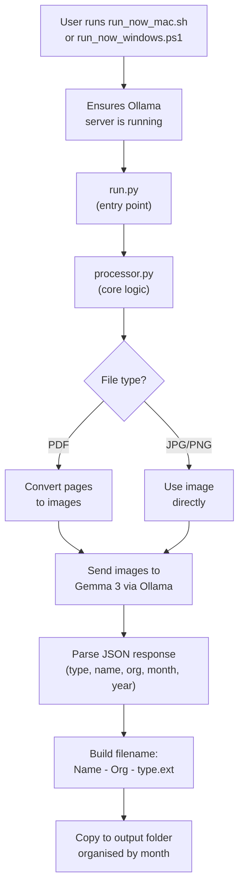
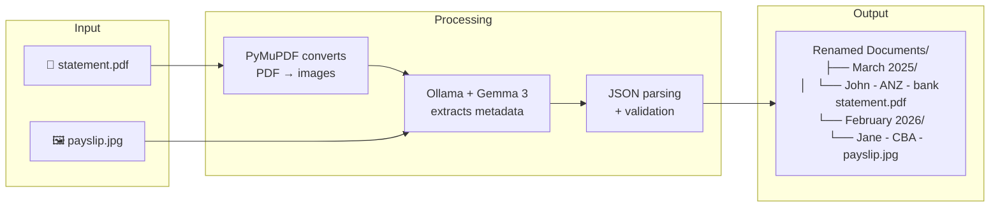

# Document Renamer — Code Walkthrough

This document explains every file in the project, what it does, and how they all fit together.

---

## Architecture Overview



---

## File-by-File Breakdown

### 1. [config.example.py](file:///Users/shashwatpasari/Programming/Document%20renamer/config.example.py) — Template Config

```python
INPUT_FOLDER = r"/path/to/your/documents"
OUTPUT_FOLDER = r"/path/to/output/Renamed Documents"
MODEL = "gemma3:4b"
SUPPORTED_EXTENSIONS = [".pdf", ".jpg", ".jpeg", ".png"]
DRY_RUN = False
```

This is a **template** that shows the user what settings are available. It is never used by the code directly. The user (or the install script) copies this to `config.py` and fills in real paths.

| Setting | Purpose |
|---|---|
| `INPUT_FOLDER` | Where the tool looks for documents to process |
| `OUTPUT_FOLDER` | Where renamed copies are saved |
| `MODEL` | Which Ollama vision model to use |
| `SUPPORTED_EXTENSIONS` | File types the tool will pick up |
| `DRY_RUN` | If `True`, prints what it *would* do without copying files |

---

### 2. [config.py](file:///Users/shashwatpasari/Programming/Document%20renamer/config.py) — Active Config (git-ignored)

Same structure as `config.example.py`, but with **real paths**. Generated automatically by the install script, or created manually by the user. This file is imported by `run.py` and `processor.py`.

---

### 3. [run.py](file:///Users/shashwatpasari/Programming/Document%20renamer/run.py) — Entry Point

```python
import sys
import config
from processor import process_all

if "--dry-run" in sys.argv:
    config.DRY_RUN = True
    print("DRY RUN MODE: Files will not be copied.")

process_all()
```

This is the **entry point** — the script you actually execute. It does two things:
1. Checks if the user passed `--dry-run` on the command line; if so, overrides `config.DRY_RUN` to `True`
2. Calls `process_all()` from `processor.py` to do the actual work

---

### 4. [processor.py](file:///Users/shashwatpasari/Programming/Document%20renamer/processor.py) — Core Logic

This is the **heart of the project**. It contains all the AI-powered document processing. Here's each function explained:

#### The Prompt (lines 12–27)

```python
PROMPT = """Analyse this document image and extract metadata.
Return ONLY valid JSON in this exact format, nothing else:
{"type": "...", "name": "...", "org": "...", "month": ..., "year": ...}
...
"""
```

This is the instruction sent to the AI model along with the document image. It tells the model exactly what to extract and in what format. The `type` field is constrained to a fixed list (e.g. `bank statement`, `payslip`, `invoice`) to ensure consistent naming.

#### Helper Functions

| Function | What it does |
|---|---|
| [sanitize](file:///Users/shashwatpasari/Programming/Document%20renamer/processor.py#L46-L51) | Removes characters that are illegal in file names (`<>:"/\|?*`) |
| [normalize_month](file:///Users/shashwatpasari/Programming/Document%20renamer/processor.py#L53-L65) | Converts month values to a number 1–12. Handles text (`"March"` → `3`), numbers, and strings (`"03"` → `3`). Uses the `MONTH_MAP` dictionary for text lookups |
| [normalize_year](file:///Users/shashwatpasari/Programming/Document%20renamer/processor.py#L67-L77) | Validates that a year is a 4-digit number between 1000 and 2100 |
| [parse_llm_response](file:///Users/shashwatpasari/Programming/Document%20renamer/processor.py#L80-L103) | Safely parses the AI model's JSON response. If the model returns extra text around the JSON, it uses a regex to extract just the `{...}` part. Then runs each field through the sanitize/normalize functions |

#### PDF Handling

| Function | What it does |
|---|---|
| [pdf_to_images](file:///Users/shashwatpasari/Programming/Document%20renamer/processor.py#L105-L119) | Uses **PyMuPDF** (`fitz`) to convert each page of a PDF into a temporary JPG image at 200 DPI. Returns a list of temp file paths. These are cleaned up after processing |

#### AI Interaction

| Function | What it does |
|---|---|
| [ask_qwen_images](file:///Users/shashwatpasari/Programming/Document%20renamer/processor.py#L121-L127) | Sends all page images to the Ollama model in a single chat request along with the prompt. The model "sees" the document and returns JSON with the extracted metadata |

#### File Naming and Output

| Function | What it does |
|---|---|
| [get_period](file:///Users/shashwatpasari/Programming/Document%20renamer/processor.py#L129-L139) | Converts year + month into a folder name like `"March 2025"`. Falls back to the current month if the AI couldn't determine the date |
| [get_output_folder](file:///Users/shashwatpasari/Programming/Document%20renamer/processor.py#L141-L145) | Creates the monthly subfolder inside `OUTPUT_FOLDER` (e.g. `Renamed Documents/March 2025/`) |
| [build_filename](file:///Users/shashwatpasari/Programming/Document%20renamer/processor.py#L147-L170) | Assembles the final filename: `Name - Org - type.ext`. Handles cases where name or org is missing gracefully |
| [unique_destination](file:///Users/shashwatpasari/Programming/Document%20renamer/processor.py#L172-L185) | Prevents overwriting — if `John Smith - ANZ - bank statement.pdf` already exists, it creates `John Smith - ANZ - bank statement (1).pdf` |

#### Main Processing

| Function | What it does |
|---|---|
| [process](file:///Users/shashwatpasari/Programming/Document%20renamer/processor.py#L187-L226) | Processes a **single file**: converts PDF → images if needed, sends to AI, builds the new name, and copies the file. Cleans up temp images in a `finally` block |
| [process_all](file:///Users/shashwatpasari/Programming/Document%20renamer/processor.py#L228-L255) | Scans the input folder recursively for supported file types, calls `process()` on each one, and prints a summary of successes and failures |

---

### 5. [install_mac.sh](file:///Users/shashwatpasari/Programming/Document%20renamer/install_mac.sh) — macOS Setup

This is a **one-time setup script** for macOS. It performs these steps in order:

| Step | What it does |
|---|---|
| 1 | Installs **Homebrew** if not present |
| 2 | Installs **Python 3.14** via Homebrew |
| 3 | Installs/upgrades **Ollama** via Homebrew |
| 4–5 | Handles Ollama version mismatches and ensures the server is running |
| 6 | Pulls the `gemma3:4b` model (~3.3 GB) if not already downloaded |
| 7–8 | Creates and activates a Python **virtual environment** |
| 9 | Installs Python dependencies (`pymupdf`, `ollama`) |
| 10–11 | Asks the user for their document folder path, creates the output folder |
| 12 | Writes `config.py` with the user's settings |

> [!NOTE]
> The script includes a `trap cleanup_ollama EXIT` — if the script started Ollama itself, it shuts it down when the script exits. If Ollama was already running, it leaves it alone.

---

### 6. [install_windows.ps1](file:///Users/shashwatpasari/Programming/Document%20renamer/install_windows.ps1) — Windows Setup

The Windows equivalent of `install_mac.sh`, written in PowerShell. Same steps, but uses **winget** instead of Homebrew to install Python and Ollama. Key differences:

- Uses `winget install --id Python.Python.3.13` (Python 3.13 on Windows)
- Refreshes `$env:Path` after installations so new commands are immediately available
- Uses PowerShell process management (`Start-Process`, `Stop-Process`) instead of Unix signals

---

### 7. [run_now_mac.sh](file:///Users/shashwatpasari/Programming/Document%20renamer/run_now_mac.sh) — macOS Runner

This is what you run **every time** you want to process documents on macOS. It:

1. Activates the Python virtual environment
2. Checks if Ollama is running; if not (or if there's a version mismatch), starts it
3. Runs `python run.py` with any arguments you pass (e.g. `--dry-run`)
4. Stops Ollama on exit if *it* started it

---

### 8. [run_now_windows.ps1](file:///Users/shashwatpasari/Programming/Document%20renamer/run_now_windows.ps1) — Windows Runner

Same as `run_now_mac.sh` but for Windows/PowerShell. Locates the Python binary inside `venv\Scripts\python.exe` and manages Ollama with PowerShell process management.

---

## Data Flow Summary



## Key Design Decisions

| Decision | Rationale |
|---|---|
| **Copies files, never moves** | Originals are never touched — safe to re-run |
| **Local AI model (Ollama)** | No data leaves the machine — important for financial documents |
| **Monthly subfolders** | Keeps output organised by document period, not processing date |
| **Duplicate-safe naming** | `(1)`, `(2)` suffixes prevent overwrites |
| **Dry-run mode** | Preview what the tool would do before committing |
| **Cross-platform** | Bash scripts for Mac, PowerShell scripts for Windows; Python core is platform-independent |
